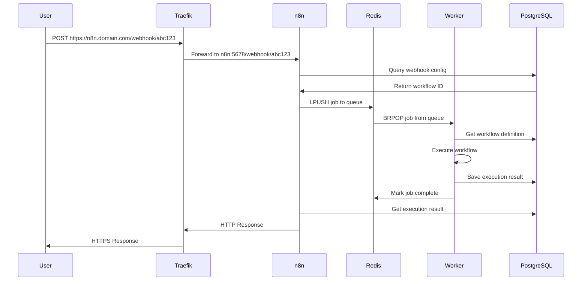

# 🐳 Documento Técnico Detallado: Sistema n8n con Arquitectura Docker

## 📌 Tabla de Contenidos

1. [Visión General del Proyecto](#visión-general-del-proyecto)
2. [Arquitectura Docker Completa](#arquitectura-docker-completa)
3. [Comunicación Interna Entre Contenedores](#comunicación-interna-entre-contenedores)
4. [Configuración de Red Docker](#configuración-de-red-docker)
5. [Flujo de Datos Entre Servicios](#flujo-de-datos-entre-servicios)
6. [Volúmenes y Persistencia de Datos](#volúmenes-y-persistencia-de-datos)
7. [Sistema de Scripts y su Interacción con Docker](#sistema-de-scripts-y-su-interacción-con-docker)
8. [Seguridad y Aislamiento](#seguridad-y-aislamiento)
9. [Troubleshooting de Comunicación](#troubleshooting-de-comunicación)
10. [Guía para Colaboradores](#guía-para-colaboradores)

---

## 🎯 Visión General del Proyecto

### Descripción del Sistema

Estamos construyendo un **Sistema Integral de Gestión para n8n** que incluye:

1. **Núcleo de n8n**: Plataforma de automatización de workflows
2. **Sistema de Actualización**: Proceso seguro sin pérdida de datos
3. **Automatización Completa**: Scripts para respaldo, monitoreo y mantenimiento
4. **Infraestructura Resiliente**: Alta disponibilidad y recuperación ante desastres

### Arquitectura Base

```
┌─────────────────────────────────────────────────────────────┐
│                    HOSTINGER VPS (Linux)                     │
├─────────────────────────────────────────────────────────────┤
│                                                             │
│  ┌─────────────────┐    ┌──────────────────────────────┐  │
│  │   DOCKER HOST   │    │   SISTEMA DE ARCHIVOS HOST   │  │
│  │                 │    │                              │  │
│  │  ┌───────────┐  │    │  /opt/n8n-scripts/          │  │
│  │  │ DOCKER    │  │    │  /opt/n8n/backups/          │  │
│  │  │ NETWORK   │  │    │  /var/log/n8n/              │  │
│  │  │ vps-net   │  │    │  /local-files/              │  │
│  │  └───────────┘  │    └──────────────────────────────┘  │
│  │                 │                                       │
│  │  Contenedores:  │    Volúmenes Externos:              │
│  │  - traefik      │    - n8n_data                       │
│  │  - n8n          │    - pg_data                        │
│  │  - n8n-worker   │    - redis_data                     │
│  │  - postgres     │                                      │
│  │  - redis        │                                      │
│  └─────────────────┘                                      │
└─────────────────────────────────────────────────────────────┘
```

---

## 🏗️ Arquitectura Docker Completa

### Docker Compose Configuration

```yaml
version: '3.7'

# VOLÚMENES EXTERNOS - Creados fuera de docker-compose
volumes:
  n8n_data:
    external: true    # Datos de aplicación n8n
  pg_data:
    external: true    # Datos PostgreSQL
  redis_data:
    external: true   # Datos Redis

# RED EXTERNA - Compartida entre servicios
networks:
  vps-net:
    external: true
    # Esta red permite:
    # - Comunicación entre contenedores por nombre
    # - Aislamiento del host
    # - Integración con Traefik
```

### Servicios y sus Roles

#### 1. Traefik (Proxy Reverso)
```yaml
traefik:
  image: traefik:v2.9
  container_name: traefik
  networks:
    - vps-net
  ports:
    - "80:80"      # HTTP
    - "443:443"    # HTTPS
    - "8080:8080"  # Dashboard (solo desarrollo)
  
  # Traefik maneja:
  # - Terminación SSL/TLS
  # - Routing basado en dominio
  # - Load balancing
  # - Middleware de seguridad
```

#### 2. n8n (Aplicación Principal)
```yaml
n8n:
  image: docker.n8n.io/n8nio/n8n:1.91.2
  container_name: n8n
  networks:
    - vps-net
  ports:
    - "5678:5678"  # Puerto interno, Traefik lo expone
  environment:
    # Configuración de Base de Datos
    - DB_TYPE=postgresdb
    - DB_POSTGRESDB_HOST=postgres  # Nombre del contenedor
    - DB_POSTGRESDB_PORT=5432
    - DB_POSTGRESDB_DATABASE=${POSTGRES_DB}
    - DB_POSTGRESDB_USER=${POSTGRES_USER}
    - DB_POSTGRESDB_PASSWORD=${POSTGRES_PASSWORD}
    
    # Configuración de Queue/Redis
    - EXECUTIONS_MODE=queue
    - QUEUE_BULL_REDIS_HOST=redis  # Nombre del contenedor
    - QUEUE_BULL_REDIS_PORT=6379
    
    # El contenedor n8n:
    # - Sirve la UI web
    # - Procesa webhooks
    # - Gestiona workflows
    # - Coordina workers
```

#### 3. n8n-worker (Procesador de Tareas)
```yaml
n8n-worker:
  image: docker.n8n.io/n8nio/n8n:1.91.2
  container_name: n8n-worker
  command: worker  # Modo worker
  networks:
    - vps-net
  environment:
    # Misma configuración de BD y Redis
    # NO expone puertos - solo procesa tareas
    
    # El worker:
    # - Escucha la cola Redis
    # - Ejecuta workflows
    # - Reporta resultados
    # - Escala horizontalmente
```

#### 4. PostgreSQL (Base de Datos)
```yaml
postgres:
  image: postgres:15
  container_name: n8n-postgres
  networks:
    - vps-net
  # NO expone puertos al host - solo accesible internamente
  environment:
    - POSTGRES_USER=${POSTGRES_USER}
    - POSTGRES_PASSWORD=${POSTGRES_PASSWORD}
    - POSTGRES_DB=${POSTGRES_DB}
  volumes:
    - pg_data:/var/lib/postgresql/data
    
    # PostgreSQL almacena:
    # - Workflows definitions
    # - Execution history
    # - Credentials (encriptadas)
    # - User data
    # - Settings
```

#### 5. Redis (Cola y Cache)
```yaml
redis:
  image: redis:6-alpine
  container_name: n8n-redis
  networks:
    - vps-net
  # NO expone puertos al host
  volumes:
    - redis_data:/data
  command: redis-server --appendonly yes
  
  # Redis maneja:
  # - Cola de tareas (Bull queue)
  # - Caché de sesiones
  # - Pub/Sub para eventos
  # - Locks distribuidos
```

---

## 🔗 Comunicación Interna Entre Contenedores

### Mapa de Comunicación Detallado

```
┌─────────────────────────────────────────────────────────────────┐
│                        DOCKER NETWORK: vps-net                   │
├─────────────────────────────────────────────────────────────────┤
│                                                                 │
│  ┌─────────────┐                                               │
│  │   TRAEFIK   │ ◄─── Puerto 80/443 desde Internet            │
│  │             │                                               │
│  └──────┬──────┘                                               │
│         │                                                       │
│         │ Proxy reverso a n8n:5678                            │
│         ▼                                                       │
│  ┌─────────────┐     SQL Queries      ┌──────────────┐        │
│  │     n8n     │ ◄─────────────────► │  PostgreSQL   │        │
│  │   (Main)    │      Port 5432      │              │        │
│  │             │                      └──────────────┘        │
│  │             │                                               │
│  │             │     Redis Protocol    ┌──────────────┐        │
│  │             │ ◄─────────────────► │    Redis      │        │
│  │             │      Port 6379      │              │        │
│  └─────────────┘                      └──────┬───────┘        │
│                                               │                │
│                                               │ Bull Queue     │
│  ┌─────────────┐                             │ Subscribe      │
│  │ n8n-worker  │ ◄───────────────────────────┘                │
│  │             │                                               │
│  │             │     SQL Queries      ┌──────────────┐        │
│  │             │ ◄─────────────────► │  PostgreSQL   │        │
│  │             │      Port 5432      │              │        │
│  └─────────────┘                      └──────────────┘        │
│                                                                 │
└─────────────────────────────────────────────────────────────────┘
```

### Detalles de Comunicación por Servicio

#### 1. Comunicación n8n → PostgreSQL

```javascript
// Conexión interna desde n8n a PostgreSQL
const dbConfig = {
  type: 'postgres',
  host: 'postgres',        // Nombre del contenedor, NO localhost
  port: 5432,             // Puerto interno del contenedor
  database: process.env.POSTGRES_DB,
  username: process.env.POSTGRES_USER,
  password: process.env.POSTGRES_PASSWORD,
  
  // La resolución DNS funciona así:
  // 1. n8n pregunta: "¿Dónde está 'postgres'?"
  // 2. Docker DNS responde: "172.18.0.3" (IP interna)
  // 3. n8n conecta a 172.18.0.3:5432
}

// Tipos de queries que realiza n8n:
// - SELECT: Obtener workflows, credenciales, ejecuciones
// - INSERT: Nuevos workflows, logs de ejecución
// - UPDATE: Estado de ejecuciones, configuraciones
// - DELETE: Limpiar historial antiguo
```

#### 2. Comunicación n8n → Redis

```javascript
// Configuración de Bull Queue en n8n
const queueConfig = {
  redis: {
    host: 'redis',         // Nombre del contenedor
    port: 6379,           // Puerto estándar Redis
    // NO se necesita password en red interna
  }
}

// Operaciones principales:
// 1. PUBLISH: n8n publica trabajos en la cola
await queue.add('execute-workflow', {
  workflowId: '123',
  data: inputData
})

// 2. Redis almacena en estructura Bull:
// bull:queue:execute-workflow:wait    (trabajos esperando)
// bull:queue:execute-workflow:active  (en proceso)
// bull:queue:execute-workflow:completed (terminados)
// bull:queue:execute-workflow:failed  (fallidos)
```

#### 3. Comunicación n8n-worker → Redis

```javascript
// Worker escucha la cola
const worker = new Worker('execute-workflow', async (job) => {
  // 1. Worker hace BLPOP en Redis (blocking pop)
  // 2. Redis devuelve el siguiente trabajo
  // 3. Worker procesa
  // 4. Worker actualiza estado en Redis
  
  const { workflowId, data } = job.data;
  
  try {
    const result = await executeWorkflow(workflowId, data);
    // Marca como completado en Redis
    return result;
  } catch (error) {
    // Marca como fallido en Redis
    throw error;
  }
}, {
  connection: {
    host: 'redis',
    port: 6379
  }
})
```

#### 4. Comunicación Traefik → n8n

```yaml
# Traefik detecta n8n por labels Docker
labels:
  - "traefik.enable=true"
  - "traefik.http.routers.n8n.rule=Host(`${N8N_HOST}`)"
  - "traefik.http.services.n8n.loadbalancer.server.port=5678"
  
# Flujo de request:
# 1. Usuario: GET https://n8n.tudominio.com/workflow/123
# 2. Traefik recibe en puerto 443
# 3. Traefik termina SSL
# 4. Traefik busca servicio 'n8n' en Docker
# 5. Traefik forwarded a n8n:5678
# 6. n8n responde
# 7. Traefik devuelve al usuario con HTTPS
```

### Comunicación de Webhooks



---

## 🌐 Configuración de Red Docker

### Red Externa vps-net

```bash
# Crear la red (una sola vez)
docker network create \
  --driver bridge \
  --subnet=172.20.0.0/16 \
  --ip-range=172.20.240.0/20 \
  --gateway=172.20.0.1 \
  vps-net

# Características de la red:
# - Driver: bridge (aislamiento entre contenedores)
# - Subnet: 172.20.0.0/16 (65,534 IPs disponibles)
# - Gateway: 172.20.0.1 (interfaz Docker en el host)
# - DNS interno: 127.0.0.11 (resuelve nombres de contenedores)
```

### Resolución DNS Interna

```bash
# Desde dentro de un contenedor
docker exec -it n8n /bin/sh

# Resolver nombre a IP
nslookup postgres
# Server:    127.0.0.11
# Address:   127.0.0.11:53
# Name:      postgres
# Address:   172.20.0.3

# Ver todas las IPs
docker network inspect vps-net
```

### Políticas de Red

```yaml
# Comunicación permitida (por defecto en bridge)
n8n → postgres       ✓ Puerto 5432
n8n → redis         ✓ Puerto 6379
n8n-worker → redis  ✓ Puerto 6379
n8n-worker → postgres ✓ Puerto 5432
traefik → n8n       ✓ Puerto 5678

# Comunicación bloqueada
postgres → n8n      ✗ (PostgreSQL no inicia conexiones)
redis → n8n        ✗ (Redis no inicia conexiones)
n8n → traefik      ✗ (n8n no necesita hablar con traefik)

# Desde el host
host → postgres    ✗ (puerto no expuesto)
host → redis      ✗ (puerto no expuesto)
host → n8n        ✓ Solo a través de Traefik
```

---

## 📊 Flujo de Datos Entre Servicios

### 1. Flujo de Creación de Workflow

```
┌──────────┐     ┌─────────┐     ┌────────┐     ┌──────────────┐
│   User   │────▶│ Traefik │────▶│  n8n   │────▶│  PostgreSQL  │
│          │     │         │     │  API   │     │              │
└──────────┘     └─────────┘     └────────┘     └──────────────┘
                                      │
                                      ▼
                              {
                                "name": "Mi Workflow",
                                "nodes": [...],
                                "connections": {...}
                              }
                                      │
                                      ▼
                              INSERT INTO workflow
```

### 2. Flujo de Ejecución de Workflow

```
┌─────────────────────────── Fase 1: Trigger ──────────────────────────┐
│                                                                      │
│  External      Traefik        n8n          PostgreSQL               │
│  System   ───▶  (443)  ───▶  (5678) ───▶   (5432)                  │
│                               │                                      │
│                               ▼ Validate                            │
│                                                                      │
└──────────────────────────────────────────────────────────────────────┘

┌─────────────────────────── Fase 2: Queue ────────────────────────────┐
│                                                                      │
│    n8n                     Redis                  n8n-worker         │
│   (Main)  ──[LPUSH]──▶   (6379)  ──[BRPOP]──▶   (Process)         │
│                            │                         │               │
│                            ▼                         ▼               │
│                    bull:queue:default         Execute nodes         │
│                                                                      │
└──────────────────────────────────────────────────────────────────────┘

┌─────────────────────────── Fase 3: Store ────────────────────────────┐
│                                                                      │
│  n8n-worker              PostgreSQL               Redis             │
│  (Complete) ───[SQL]──▶  (Store)   ───[DEL]──▶  (Cleanup)         │
│                                                                      │
└──────────────────────────────────────────────────────────────────────┘
```

### 3. Flujo de Datos en Memoria

```javascript
// Límites de memoria por contenedor
n8n: {
  heap: "2GB",      // Node.js heap
  buffer: "512MB",  // Para archivos temporales
  total: "2.5GB"
}

n8n-worker: {
  heap: "1GB",      // Menos UI, más procesamiento
  buffer: "1GB",    // Más espacio para datos
  total: "2GB"
}

postgres: {
  shared_buffers: "256MB",
  work_mem: "4MB",
  maintenance_work_mem: "64MB"
}

redis: {
  maxmemory: "512MB",
  maxmemory_policy: "allkeys-lru"  // Elimina keys antiguos
}
```

---

## 💾 Volúmenes y Persistencia de Datos

### Estructura de Volúmenes Externos

```bash
# Volumen n8n_data
/var/lib/docker/volumes/n8n_data/_data/
├── .n8n/
│   ├── config                    # Configuración de n8n
│   ├── nodes/                    # Nodos personalizados
│   │   └── custom/               # Tus nodos custom
│   ├── packages/                 # NPM packages
│   └── webhook-test-data/        # Datos de prueba webhooks

# Volumen pg_data  
/var/lib/docker/volumes/pg_data/_data/
├── base/                         # Bases de datos
│   └── 16384/                    # n8n database
├── global/                       # Configuración global
├── pg_wal/                       # Write-Ahead Logging
└── postgresql.conf               # Configuración

# Volumen redis_data
/var/lib/docker/volumes/redis_data/_data/
├── dump.rdb                      # Snapshot periódico
└── appendonly.aof                # Append-only file (si está habilitado)
```

### Mapeo de Volúmenes Host

```yaml
n8n:
  volumes:
    # Volumen Docker nombrado (recomendado)
    - n8n_data:/home/node/.n8n
    
    # Bind mount desde host (para archivos compartidos)
    - /local-files:/files
    #   ↑            ↑
    #   Host path    Container path
    
    # Permisos: El usuario 'node' (UID 1000) debe poder escribir
```

### Backup de Volúmenes

```bash
# Método 1: Backup directo del volumen
docker run --rm \
  -v n8n_data:/source:ro \
  -v /opt/backups:/backup \
  alpine tar czf /backup/n8n_data_$(date +%Y%m%d).tar.gz -C /source .

# Método 2: Backup a través del contenedor
docker exec n8n tar czf /tmp/backup.tar.gz /home/node/.n8n
docker cp n8n:/tmp/backup.tar.gz /opt/backups/

# Método 3: Snapshot del filesystem (más eficiente)
# Si usas LVM o ZFS
lvcreate -L 1G -s -n n8n_snapshot /dev/vg0/docker
```

---

## 🔧 Sistema de Scripts y su Interacción con Docker

### Arquitectura de Scripts

```bash
/opt/n8n-scripts/
├── bin/
│   ├── backup.sh        # Interactúa con todos los contenedores
│   ├── monitor.sh       # Verifica salud de contenedores
│   └── maintain.sh      # Mantenimiento de contenedores
├── lib/
│   └── docker-utils.sh  # Funciones helper para Docker
└── config/
    └── docker.conf      # Configuración Docker
```

### Comunicación Scripts → Docker

```bash
#!/bin/bash
# lib/docker-utils.sh - Utilidades Docker detalladas

# Función para ejecutar comandos en contenedores
docker_exec() {
    local container="$1"
    shift
    local command="$@"
    
    # Verificar que el contenedor existe y está corriendo
    if ! docker ps --format "{{.Names}}" | grep -q "^${container}$"; then
        log ERROR "Contenedor ${container} no está corriendo"
        return 1
    fi
    
    # Ejecutar comando
    # -i: Mantiene STDIN abierto
    # -t: Asigna pseudo-TTY (no usar en scripts)
    docker exec -i "${container}" ${command}
}

# Comunic