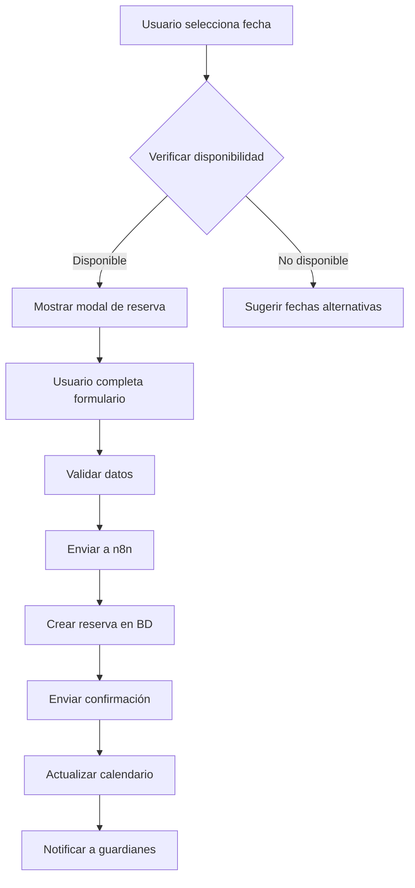
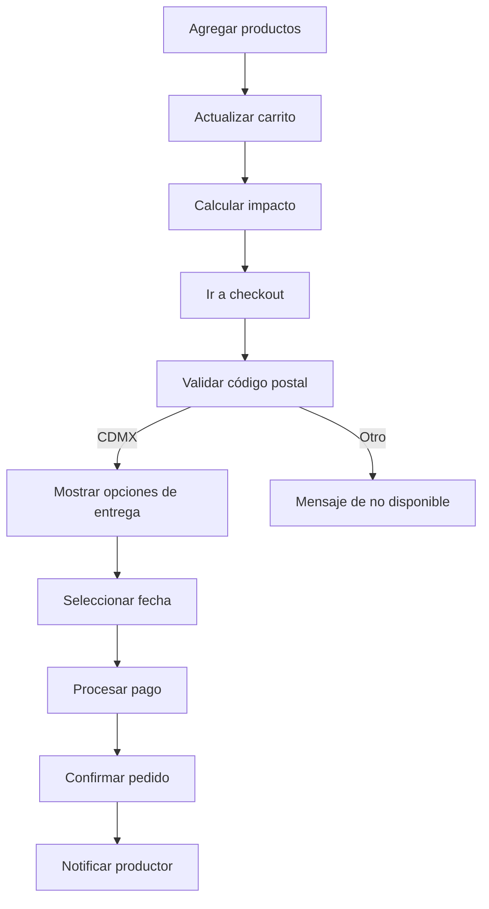
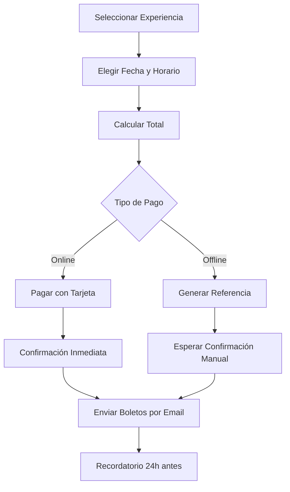
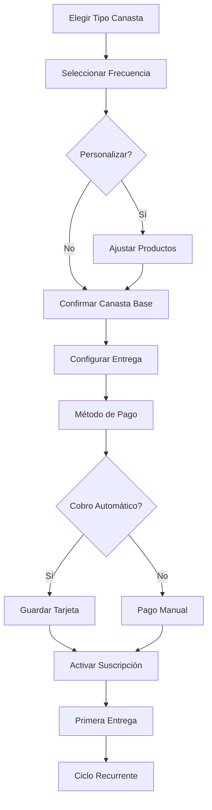

# 📚 Documentación Técnica Completa - Arca Tierra Web App

**Versión 2.0 | Enero 2025**

---

## 🌟 Tabla de Contenidos

1. [Resumen Ejecutivo](#resumen-ejecutivo)
2. [Visión y Objetivos](#visión-y-objetivos)
3. [Arquitectura del Sistema](#arquitectura-del-sistema)
4. [Stack Tecnológico](#stack-tecnológico)
5. [Estructura del Proyecto](#estructura-del-proyecto)
6. [Componentes Principales](#componentes-principales)
7. [Sistema de Diseño](#sistema-de-diseño)
8. [Flujos de Datos](#flujos-de-datos)
9. [Guía de Implementación](#guía-de-implementación)
10. [Mejores Prácticas](#mejores-prácticas)
11. [Optimización y Rendimiento](#optimización-y-rendimiento)
12. [Seguridad](#seguridad)
13. [Despliegue](#despliegue)
14. [Mantenimiento](#mantenimiento)

---

## 🎯 Resumen Ejecutivo

Arca Tierra es una plataforma digital innovadora que conecta experiencias sustentables en las chinampas de Xochimilco con clientes conscientes del medio ambiente. La aplicación integra:

- **E-commerce de productos orgánicos** con sistema de canastas personalizadas
- **Calendario de experiencias** con 3 vistas (mes, semana, día)
- **Panel de gestión para guardianes** (empleados)
- **Sistema de reservas** con notificaciones en tiempo real
- **Calculadora de impacto ambiental** integrada

### Métricas Clave del Proyecto
- 🌱 **10+ productos orgánicos** de productores locales
- 🎯 **12 experiencias únicas** (públicas y privadas)
- 👥 **6 roles de empleados** definidos
- 📊 **4 formatos de exportación** de datos
- 🏞️ **4 chinampas** operativas

---

## 🌍 Visión y Objetivos

### Visión
Ser la plataforma líder en turismo sustentable de Xochimilco, conectando la tradición chinampera con la tecnología moderna.

### Objetivos Principales
1. **Digitalizar** la operación de experiencias turísticas
2. **Facilitar** la venta de productos orgánicos locales
3. **Optimizar** la coordinación del equipo de trabajo
4. **Medir** el impacto ambiental positivo
5. **Escalar** el modelo de negocio sustentable

### Valores de Marca
- 🌿 **Sustentabilidad**: En cada decisión técnica
- 🤝 **Comunidad**: Apoyo a productores locales
- 🎨 **Tradición**: Respeto por la cultura chinampera
- 💡 **Innovación**: Tecnología al servicio de la naturaleza

---

## 🏗️ Arquitectura del Sistema

### Arquitectura General
```
┌─────────────────────────────────────────────────────────┐
│                    FRONTEND (Next.js)                    │
│  ┌─────────────┐ ┌──────────────┐ ┌─────────────────┐  │
│  │   Tienda    │ │  Calendario  │ │ Panel Guardianes│  │
│  └─────────────┘ └──────────────┘ └─────────────────┘  │
└─────────────────────────┬───────────────────────────────┘
                          │ API REST
┌─────────────────────────▼───────────────────────────────┐
│                    BACKEND (n8n)                         │
│  ┌─────────────┐ ┌──────────────┐ ┌─────────────────┐  │
│  │  Workflows  │ │   Webhooks   │ │ Automatizaciones│  │
│  └─────────────┘ └──────────────┘ └─────────────────┘  │
└─────────────────────────┬───────────────────────────────┘
                          │
┌─────────────────────────▼───────────────────────────────┐
│               SERVICIOS EXTERNOS                         │
│  ┌──────────┐ ┌───────────────┐ ┌──────────────────┐   │
│  │  Google  │ │   WhatsApp    │ │     Stripe       │   │
│  │ Calendar │ │  Business API │ │  (Pagos - MVP2)  │   │
│  └──────────┘ └───────────────┘ └──────────────────┘   │
└──────────────────────────────────────────────────────────┘
```

### Componentes del Sistema

1. **Frontend (Next.js 14+)**
   - App Router para routing moderno
   - Server Components para SEO
   - Client Components para interactividad
   - Streaming SSR para performance

2. **Backend (n8n)**
   - Workflows visuales
   - Integración con APIs externas
   - Automatización de procesos
   - Gestión de notificaciones

3. **Base de Datos**
   - PostgreSQL para datos estructurados
   - Redis para caché y sesiones
   - S3-compatible para archivos

---

## 💻 Stack Tecnológico

### Frontend
```typescript
{
  "framework": "Next.js 14.2+",
  "ui": {
    "styling": "Tailwind CSS 3.4",
    "components": "Radix UI + Shadcn/ui",
    "animations": "Framer Motion 11",
    "icons": "Lucide React"
  },
  "state": {
    "global": "Zustand 4.5",
    "server": "TanStack Query 5"
  },
  "calendar": {
    "mvp": "FullCalendar 6.1",
    "production": "Custom Hybrid Calendar"
  },
  "charts": "Recharts 2.12",
  "forms": "React Hook Form + Zod",
  "dates": "date-fns 3.0"
}
```

### Backend (n8n)
```yaml
workflows:
  - experiencias:
      - crear_reserva
      - enviar_confirmacion
      - sincronizar_calendario
  - productos:
      - procesar_pedido
      - notificar_productor
      - actualizar_inventario
  - empleados:
      - asignar_tareas
      - registrar_asistencia
      - calcular_metricas
```

### Infraestructura
```yaml
servidor:
  tipo: VPS
  specs:
    cpu: 8 núcleos
    ram: 32GB
    storage: 500GB SSD
  
servicios:
  - nginx: reverse proxy
  - pm2: process manager
  - certbot: SSL certificates
  - docker: containerización
```

---

## 📁 Estructura del Proyecto

```
arcatierra-webapp/
├── 📁 public/
│   ├── 📁 images/          # Imágenes optimizadas
│   ├── 📁 data/           # CSVs del calendario
│   └── 📁 fonts/          # Fuentes locales
│
├── 📁 src/
│   ├── 📁 app/            # App Router Pages
│   │   ├── 📄 page.tsx    # Home
│   │   ├── 📁 tienda/
│   │   ├── 📁 experiencias/
│   │   ├── 📁 panel-guardianes/
│   │   └── 📁 api/        # API Routes
│   │
│   ├── 📁 components/
│   │   ├── 📁 layout/     # Header, Footer
│   │   ├── 📁 calendario/ # Calendar components
│   │   ├── 📁 tienda/     # E-commerce
│   │   ├── 📁 guardianes/ # Employee panel
│   │   └── 📁 ui/         # Shared components
│   │
│   ├── 📁 lib/
│   │   ├── 📁 calendar/   # Calendar utilities
│   │   ├── 📁 mockData/   # Development data
│   │   ├── 📁 utils/      # Helper functions
│   │   └── 📁 hooks/      # Custom hooks
│   │
│   ├── 📁 styles/
│   │   └── 📄 globals.css # Global styles
│   │
│   └── 📁 types/          # TypeScript types
│
├── 📁 scripts/            # Build & deploy scripts
├── 📄 .env.local         # Environment variables
└── 📄 package.json       # Dependencies
```

---

## 🧩 Componentes Principales

### 1. Calendario de Experiencias

#### Características Implementadas
- ✅ **3 Vistas**: Mes, Semana, Día
- ✅ **Sistema de Slots**: Disponibilidad en tiempo real
- ✅ **Filtros**: Por tipo, chinampa, disponibilidad
- ✅ **Exportación**: Excel, PDF, CSV, Markdown
- ✅ **Modo Empleado**: Vista con contraseña
- ✅ **Tooltips Inteligentes**: Información contextual

#### Estructura de Datos
```typescript
interface Experiencia {
  id: string;
  nombre: string;
  tipo: 'público' | 'privado';
  descripcion: string;
  duracion: number; // minutos
  precio: {
    adulto: number;
    niño: number;
  };
  capacidad: {
    min: number;
    max: number;
  };
  chinampas: string[];
  horarios: Horario[];
  incluye: string[];
  requisitos: string[];
  imagenes: string[];
  coordenadas: {
    lat: number;
    lng: number;
  };
}

interface Slot {
  fecha: Date;
  experienciaId: string;
  disponible: number;
  reservados: number;
  estado: 'disponible' | 'pocosLugares' | 'lleno';
}
```

### 2. E-commerce de Canastas

#### Características Implementadas
- ✅ **Catálogo Dinámico**: Filtros y búsqueda
- ✅ **Carrito Persistente**: Con Zustand
- ✅ **Calculadora de Impacto**: CO₂, agua, plástico
- ✅ **Sistema de Productores**: Perfiles completos
- ✅ **Animaciones**: Confetti al agregar productos

#### Estructura de Productos
```typescript
interface Producto {
  id: string;
  sku: string;
  slug: string;
  nombre: string;
  categoria: Categoria;
  subcategoria: string;
  descripcion: string;
  precio: number;
  unidad: 'kg' | 'pieza' | 'manojo';
  stock: number;
  productor: Productor;
  imagenes: string[];
  certificaciones: Certificacion[];
  impactoAmbiental: {
    co2Ahorrado: number;
    aguaAhorrada: number;
    plasticoEvitado: number;
  };
  disponibilidad: {
    lunes: boolean;
    martes: boolean;
    // ... etc
  };
}
```

### 3. Panel de Guardianes

#### Características Únicas
- 🎯 **Sistema de Post-its**: Comunicación visual
- 📊 **Métricas en Tiempo Real**: Chart.js
- ✅ **Gestión de Tareas**: Checkboxes interactivos
- 🎉 **Mensajes Motivadores**: Aleatorios diarios
- 👥 **Vista por Empleado**: Personalizada

#### Roles y Permisos
```typescript
enum RolEmpleado {
  COORDINADOR = 'coordinador',
  GUIA = 'guia',
  CHEF = 'chef',
  AGRICULTOR = 'agricultor',
  APOYO = 'apoyo',
  ADMIN = 'admin'
}

interface Empleado {
  id: string;
  nombre: string;
  rol: RolEmpleado;
  avatar: string;
  chinampaAsignada?: string;
  metricas: {
    tareasCompletadas: number;
    experienciasGuiadas: number;
    satisfaccionClientes: number;
  };
  horario: Horario[];
}
```

---

## 🎨 Sistema de Diseño

### Paleta de Colores
```css
:root {
  /* Colores Principales */
  --verde-bosque: #33503E;      /* Principal */
  --terracota: #BA6440;         /* Secundario */
  --crema: #F2E8D2;            /* Fondo */
  --marron-cobre: #B15543;     /* Acento */
  
  /* Colores de Estado */
  --exito: #4CAF50;
  --advertencia: #FF9800;
  --error: #F44336;
  --info: #2196F3;
  
  /* Grises */
  --gris-900: #212121;
  --gris-700: #616161;
  --gris-500: #9E9E9E;
  --gris-300: #E0E0E0;
  --gris-100: #F5F5F5;
}
```

### Tipografía
```css
/* Títulos */
--font-display: 'Playfair Display', serif;

/* Cuerpo */
--font-body: 'Open Sans', sans-serif;

/* Escalas */
--text-xs: 0.75rem;    /* 12px */
--text-sm: 0.875rem;   /* 14px */
--text-base: 1rem;     /* 16px */
--text-lg: 1.125rem;   /* 18px */
--text-xl: 1.25rem;    /* 20px */
--text-2xl: 1.5rem;    /* 24px */
--text-3xl: 1.875rem;  /* 30px */
--text-4xl: 2.25rem;   /* 36px */
```

### Componentes UI Base

#### Botones
```typescript
// Variantes
type ButtonVariant = 'primary' | 'secondary' | 'outline' | 'ghost';

// Tamaños
type ButtonSize = 'sm' | 'md' | 'lg';

// Ejemplo de uso
<Button 
  variant="primary" 
  size="lg"
  onClick={handleReservar}
  className="w-full"
>
  Reservar Experiencia
</Button>
```

#### Cards
```typescript
interface CardProps {
  variant?: 'default' | 'elevated' | 'outlined';
  interactive?: boolean;
  className?: string;
}

// Uso
<Card variant="elevated" interactive>
  <CardHeader>
    <CardTitle>Amanecer Chinampero</CardTitle>
  </CardHeader>
  <CardContent>
    {/* Contenido */}
  </CardContent>
</Card>
```

---

## 🔄 Flujos de Datos

### Flujo de Reserva de Experiencia


### Flujo de Compra de Canasta


---

## 📋 Guía de Implementación

### Fase 1: MVP (2-3 semanas)

#### Semana 1-2: Core Features
```bash
# 1. Setup inicial
npx create-next-app@latest arcatierra-webapp --typescript --tailwind --app

# 2. Instalar dependencias core
npm install zustand @tanstack/react-query framer-motion
npm install @fullcalendar/react @fullcalendar/daygrid
npm install recharts react-hook-form zod

# 3. Configurar estructura base
mkdir -p src/{components,lib,hooks,types,styles}

# 4. Implementar autenticación mock
# 5. Crear layout principal con Header/Footer
# 6. Implementar página home
```

#### Semana 2-3: Funcionalidades
- [ ] Migrar calendario HTML a React
- [ ] Implementar catálogo de productos
- [ ] Crear sistema de carrito
- [ ] Configurar rutas API mock
- [ ] Implementar exportación de datos

### Fase 2: Integración (2 semanas)

#### Semana 4: Backend n8n
```javascript
// Endpoints principales
const API_ENDPOINTS = {
  // Experiencias
  'GET /api/experiencias': 'Lista todas las experiencias',
  'GET /api/experiencias/slots': 'Disponibilidad por fecha',
  'POST /api/experiencias/reservar': 'Crear reserva',
  
  // Productos
  'GET /api/productos': 'Catálogo de productos',
  'GET /api/productores': 'Lista de productores',
  'POST /api/pedidos': 'Crear pedido',
  
  // Empleados
  'GET /api/empleados/tareas': 'Tareas del día',
  'POST /api/empleados/checkin': 'Registro entrada',
  'GET /api/empleados/metricas': 'Dashboard metrics'
};
```

#### Semana 5: Testing y Optimización
- [ ] Tests de integración
- [ ] Optimización de imágenes
- [ ] Lazy loading
- [ ] PWA setup
- [ ] Analytics

### Fase 3: Producción (1 semana)

#### Deployment Checklist
```bash
# 1. Variables de entorno
NEXT_PUBLIC_API_URL=https://api.arcatierra.com
NEXT_PUBLIC_GOOGLE_MAPS_KEY=xxx
N8N_WEBHOOK_URL=xxx

# 2. Build optimization
npm run build
npm run analyze

# 3. Docker setup
docker build -t arcatierra-webapp .
docker-compose up -d

# 4. Nginx config
server {
    server_name arcatierra.com;
    location / {
        proxy_pass http://localhost:3000;
    }
}

# 5. SSL
certbot --nginx -d arcatierra.com
```

---

## 🚀 Mejores Prácticas

### Código Limpio
```typescript
// ❌ Evitar
const d = new Date();
const x = d.getDay() === 0 || d.getDay() === 6;

// ✅ Preferir
const today = new Date();
const isWeekend = today.getDay() === 0 || today.getDay() === 6;
```

### Componentes Reutilizables
```typescript
// ✅ Componente bien estructurado
interface ExperienceCardProps {
  experiencia: Experiencia;
  onReservar?: (id: string) => void;
  mostrarPrecio?: boolean;
  className?: string;
}

export const ExperienceCard: FC<ExperienceCardProps> = ({
  experiencia,
  onReservar,
  mostrarPrecio = true,
  className
}) => {
  // Lógica clara y separada
  const handleClick = useCallback(() => {
    onReservar?.(experiencia.id);
  }, [experiencia.id, onReservar]);

  return (
    <Card className={cn('p-4', className)}>
      {/* Contenido */}
    </Card>
  );
};
```

### Performance
```typescript
// ✅ Lazy loading de componentes pesados
const CalendarioExperiencias = lazy(() => 
  import('@/components/calendario/CalendarioExperiencias')
);

// ✅ Memoización de cálculos costosos
const impactoTotal = useMemo(() => {
  return productos.reduce((acc, producto) => ({
    co2: acc.co2 + producto.impactoAmbiental.co2Ahorrado,
    agua: acc.agua + producto.impactoAmbiental.aguaAhorrada,
    plastico: acc.plastico + producto.impactoAmbiental.plasticoEvitado
  }), { co2: 0, agua: 0, plastico: 0 });
}, [productos]);
```

---

## ⚡ Optimización y Rendimiento

### Estrategias de Optimización

#### 1. Imágenes
```typescript
// next.config.js
module.exports = {
  images: {
    domains: ['images.unsplash.com'],
    formats: ['image/avif', 'image/webp'],
    deviceSizes: [640, 750, 1080, 1200, 1920],
  }
};

// Uso
<Image
  src={producto.imagenes[0]}
  alt={producto.nombre}
  width={400}
  height={300}
  quality={85}
  placeholder="blur"
  blurDataURL={producto.blurDataURL}
/>
```

#### 2. Bundling
```javascript
// Análisis de bundle
npm install @next/bundle-analyzer

// next.config.js
const withBundleAnalyzer = require('@next/bundle-analyzer')({
  enabled: process.env.ANALYZE === 'true',
});

module.exports = withBundleAnalyzer({
  // config
});
```

#### 3. Caché
```typescript
// API Route con caché
export const revalidate = 3600; // 1 hora

// Cliente con React Query
const { data } = useQuery({
  queryKey: ['experiencias'],
  queryFn: fetchExperiencias,
  staleTime: 5 * 60 * 1000, // 5 minutos
  cacheTime: 10 * 60 * 1000, // 10 minutos
});
```

### Métricas de Performance

#### Core Web Vitals Target
- **LCP** (Largest Contentful Paint): < 2.5s
- **FID** (First Input Delay): < 100ms
- **CLS** (Cumulative Layout Shift): < 0.1

#### Monitoreo
```typescript
// app/layout.tsx
import { Analytics } from '@vercel/analytics/react';
import { SpeedInsights } from '@vercel/speed-insights/next';

export default function RootLayout({ children }) {
  return (
    <html>
      <body>
        {children}
        <Analytics />
        <SpeedInsights />
      </body>
    </html>
  );
}
```

---

## 🔒 Seguridad

### Medidas Implementadas

#### 1. Autenticación y Autorización
```typescript
// middleware.ts
export function middleware(request: NextRequest) {
  const token = request.cookies.get('auth-token');
  
  if (!token && request.nextUrl.pathname.startsWith('/panel-guardianes')) {
    return NextResponse.redirect(new URL('/login', request.url));
  }
  
  return NextResponse.next();
}
```

#### 2. Validación de Datos
```typescript
// schemas/reserva.schema.ts
import { z } from 'zod';

export const reservaSchema = z.object({
  experienciaId: z.string().uuid(),
  fecha: z.date().min(new Date()),
  participantes: z.object({
    adultos: z.number().min(1).max(20),
    niños: z.number().min(0).max(20)
  }),
  contacto: z.object({
    nombre: z.string().min(2).max(100),
    email: z.string().email(),
    telefono: z.string().regex(/^\+?[\d\s-()]+$/)
  })
});
```

#### 3. Headers de Seguridad
```typescript
// next.config.js
const securityHeaders = [
  {
    key: 'X-DNS-Prefetch-Control',
    value: 'on'
  },
  {
    key: 'Strict-Transport-Security',
    value: 'max-age=63072000; includeSubDomains; preload'
  },
  {
    key: 'X-Frame-Options',
    value: 'SAMEORIGIN'
  },
  {
    key: 'X-Content-Type-Options',
    value: 'nosniff'
  },
  {
    key: 'Referrer-Policy',
    value: 'origin-when-cross-origin'
  }
];
```

### Checklist de Seguridad
- [x] HTTPS en producción
- [x] Validación de inputs
- [x] Sanitización de datos
- [x] Rate limiting en APIs
- [x] CORS configurado
- [x] Secrets en variables de entorno
- [x] Dependencias actualizadas
- [x] SQL injection prevention
- [x] XSS protection

---

## 🚢 Despliegue

### Opción 1: VPS con Docker

#### Docker Compose
```yaml
version: '3.8'

services:
  webapp:
    build: .
    ports:
      - "3000:3000"
    environment:
      - NODE_ENV=production
      - NEXT_PUBLIC_API_URL=${API_URL}
    volumes:
      - ./public/data:/app/public/data
    restart: unless-stopped

  nginx:
    image: nginx:alpine
    ports:
      - "80:80"
      - "443:443"
    volumes:
      - ./nginx.conf:/etc/nginx/nginx.conf
      - ./ssl:/etc/nginx/ssl
    depends_on:
      - webapp
    restart: unless-stopped

  redis:
    image: redis:alpine
    ports:
      - "6379:6379"
    volumes:
      - redis_data:/data
    restart: unless-stopped

volumes:
  redis_data:
```

### Opción 2: Vercel (Recomendado para MVP)

```bash
# 1. Instalar Vercel CLI
npm i -g vercel

# 2. Deploy
vercel

# 3. Configurar dominio
vercel domains add arcatierra.com

# 4. Variables de entorno
vercel env add NEXT_PUBLIC_API_URL
```

### CI/CD Pipeline

#### GitHub Actions
```yaml
name: Deploy to Production

on:
  push:
    branches: [main]

jobs:
  deploy:
    runs-on: ubuntu-latest
    
    steps:
      - uses: actions/checkout@v3
      
      - name: Setup Node
        uses: actions/setup-node@v3
        with:
          node-version: '20'
          
      - name: Install dependencies
        run: npm ci
        
      - name: Run tests
        run: npm test
        
      - name: Build
        run: npm run build
        
      - name: Deploy to VPS
        uses: appleboy/ssh-action@master
        with:
          host: ${{ secrets.HOST }}
          username: ${{ secrets.USERNAME }}
          key: ${{ secrets.SSH_KEY }}
          script: |
            cd /var/www/arcatierra
            git pull
            npm install
            npm run build
            pm2 restart arcatierra
```

---

## 🛠️ Mantenimiento

### Tareas Diarias
- [ ] Revisar logs de errores
- [ ] Verificar disponibilidad del sitio
- [ ] Monitorear uso de recursos
- [ ] Backup de base de datos

### Tareas Semanales
- [ ] Actualizar calendario con nuevas experiencias
- [ ] Revisar métricas de performance
- [ ] Actualizar inventario de productos
- [ ] Generar reportes para el equipo

### Tareas Mensuales
- [ ] Actualizar dependencias
- [ ] Revisar y optimizar queries
- [ ] Auditoría de seguridad
- [ ] Análisis de analytics

### Scripts de Mantenimiento
```json
{
  "scripts": {
    "backup:db": "pg_dump $DATABASE_URL > backup_$(date +%Y%m%d).sql",
    "clean:logs": "find ./logs -name '*.log' -mtime +30 -delete",
    "update:deps": "npm update && npm audit fix",
    "generate:sitemap": "next-sitemap",
    "analyze:bundle": "ANALYZE=true npm run build"
  }
}
```

---

## 📊 Monitoreo y Analytics

### Herramientas Configuradas
1. **Google Analytics 4** - Comportamiento de usuarios
2. **Sentry** - Tracking de errores
3. **LogRocket** - Session replay
4. **Prometheus + Grafana** - Métricas del servidor

### KPIs Principales
```typescript
interface MetricasClave {
  // Negocio
  reservasPorDia: number;
  tasaConversion: number;
  ticketPromedio: number;
  
  // Técnicas
  uptime: number; // 99.9% target
  responseTime: number; // <200ms p95
  errorRate: number; // <0.1%
  
  // UX
  bounceRate: number;
  sessionDuration: number;
  paginasPorSesion: number;
}
```

---

## 🤝 Contribución

### Flujo de Trabajo
1. **Feature Branch**: `feature/nombre-feature`
2. **Commit Convention**: `tipo(scope): mensaje`
3. **Pull Request**: Con descripción y screenshots
4. **Code Review**: Mínimo 1 aprobación
5. **Merge**: Squash and merge

### Estándares de Código
```bash
# Linting
npm run lint

# Formatting
npm run format

# Type checking
npm run type-check

# Tests
npm run test
```

---

## 📚 Recursos Adicionales

### Documentación
- [Next.js Docs](https://nextjs.org/docs)
- [n8n Docs](https://docs.n8n.io/)
- [Tailwind CSS](https://tailwindcss.com/docs)
- [FullCalendar](https://fullcalendar.io/docs)

### Herramientas de Desarrollo
- **Windsurf** - IDE configurado
- **TablePlus** - GUI para PostgreSQL
- **Insomnia** - Testing de APIs
- **Figma** - Diseños y prototipos

### Contactos del Equipo
- **Desarrollo**: desarrollo@arcatierra.com
- **Diseño**: diseno@arcatierra.com
- **Soporte**: soporte@arcatierra.com

---

## 💳 Sistema de Pagos y Cobros

### Métodos de Pago Implementados

#### Para MVP (Fase 1)
```typescript
enum MetodoPago {
  TRANSFERENCIA = 'transferencia',
  EFECTIVO = 'efectivo',
  DEPOSITO = 'deposito'
}

// Proceso manual con confirmación
interface ProcesoCobroMVP {
  paso1: 'Cliente realiza pedido';
  paso2: 'Sistema genera referencia única';
  paso3: 'Cliente realiza pago (transferencia/depósito)';
  paso4: 'Admin confirma pago en panel';
  paso5: 'Sistema activa pedido/reserva';
}
```

#### Para Producción (Fase 2)
```typescript
// Integración con procesadores de pago
interface ProcesadoresPago {
  stripe: {
    tarjetas: ['Visa', 'Mastercard', 'Amex'];
    msi: [3, 6, 12]; // Meses sin intereses
    comision: '3.6% + $3 MXN';
  };
  mercadoPago: {
    metodos: ['Tarjeta', 'OXXO', 'Transferencia'];
    msi: [3, 6, 9, 12];
    comision: '3.49% + IVA';
  };
  paypal: {
    internacional: true;
    monedas: ['MXN', 'USD'];
    comision: '3.9% + tarifa fija';
  };
}
```

### Flujo de Cobro para Experiencias


### Políticas de Cobro

#### Experiencias
```typescript
interface PoliticasExperiencias {
  anticipo: {
    porcentaje: 50; // 50% al reservar
    tiempoLimite: 48; // horas para pagar
  };
  cancelacion: {
    sinCosto: 72; // horas antes
    penalizacion50: 48; // horas antes
    sinReembolso: 24; // horas antes
  };
  gruposGrandes: {
    minPersonas: 10;
    anticipoRequerido: 100; // 100%
    facturaDisponible: true;
  };
}
```

#### Canastas (Compra Única)
```typescript
interface PoliticasCanastas {
  pagoTotal: true;
  confirmacionPedido: '24-48 horas';
  cambios: {
    permitidos: true;
    tiempoLimite: '24h antes de entrega';
  };
}
```

---

## 📦 Sistema de Suscripciones de Canastas

### Modelo de Suscripción

#### Tipos de Suscripción
```typescript
interface TipoSuscripcion {
  id: string;
  nombre: 'Semanal' | 'Quincenal' | 'Mensual';
  frecuencia: number; // días
  descuento: number; // porcentaje
  beneficios: string[];
}

const suscripciones: TipoSuscripcion[] = [
  {
    id: 'semanal',
    nombre: 'Semanal',
    frecuencia: 7,
    descuento: 10,
    beneficios: [
      'Productos más frescos',
      'Prioridad en productos limitados',
      'Recetas exclusivas semanales',
      'Ajustes ilimitados'
    ]
  },
  {
    id: 'quincenal',
    nombre: 'Quincenal',
    frecuencia: 14,
    descuento: 7,
    beneficios: [
      'Flexibilidad de entrega',
      'Productos de temporada garantizados',
      'Recetas quincenales',
      '2 ajustes por entrega'
    ]
  },
  {
    id: 'mensual',
    nombre: 'Mensual',
    frecuencia: 30,
    descuento: 5,
    beneficios: [
      'Ideal para familias pequeñas',
      'Planificación mensual',
      '1 ajuste por entrega'
    ]
  }
];
```

### Tipos de Canastas

#### Canastas Predefinidas
```typescript
interface CanastaBase {
  id: string;
  nombre: string;
  descripcion: string;
  tamano: 'Chica' | 'Mediana' | 'Grande' | 'Familiar';
  precio: {
    unica: number;
    semanal: number;
    quincenal: number;
    mensual: number;
  };
  contenidoBase: ProductoCanasta[];
  personalizable: boolean;
}

const canastasDisponibles: CanastaBase[] = [
  {
    id: 'basica',
    nombre: 'Canasta Básica Chinampera',
    descripcion: 'Verduras esenciales de temporada',
    tamano: 'Mediana',
    precio: {
      unica: 350,
      semanal: 315,      // 10% desc
      quincenal: 325,    // 7% desc
      mensual: 332       // 5% desc
    },
    contenidoBase: [
      { producto: 'Jitomate', cantidad: 1, unidad: 'kg' },
      { producto: 'Cebolla', cantidad: 500, unidad: 'g' },
      { producto: 'Lechuga', cantidad: 2, unidad: 'pza' },
      { producto: 'Calabaza', cantidad: 3, unidad: 'pza' },
      { producto: 'Cilantro', cantidad: 1, unidad: 'manojo' }
    ],
    personalizable: true
  },
  {
    id: 'premium',
    nombre: 'Canasta Premium Xochimilco',
    descripcion: 'Selección gourmet con productos especiales',
    tamano: 'Grande',
    precio: {
      unica: 650,
      semanal: 585,
      quincenal: 604,
      mensual: 617
    },
    contenidoBase: [
      // Contenido premium...
    ],
    personalizable: true
  },
  {
    id: 'familiar',
    nombre: 'Canasta Familiar Sustentable',
    descripcion: 'Perfecta para familias de 4-6 personas',
    tamano: 'Familiar',
    precio: {
      unica: 890,
      semanal: 801,
      quincenal: 827,
      mensual: 845
    },
    contenidoBase: [
      // Contenido familiar...
    ],
    personalizable: false
  }
];
```

### Gestión de Suscripciones

#### Estado de Suscripción
```typescript
interface Suscripcion {
  id: string;
  clienteId: string;
  tipo: 'semanal' | 'quincenal' | 'mensual';
  canasta: CanastaBase;
  personalizaciones?: PersonalizacionCanasta[];
  estado: 'activa' | 'pausada' | 'cancelada';
  fechaInicio: Date;
  proximaEntrega: Date;
  historialEntregas: Entrega[];
  
  // Configuración de entrega
  direccionEntrega: Direccion;
  diaPreferido: DiaSemana;
  horarioPreferido: 'manana' | 'tarde';
  instruccionesEspeciales?: string;
  
  // Cobro
  metodoPagoDefault: string;
  cobrosAutomaticos: boolean;
  historialPagos: Pago[];
}
```

#### Personalización de Canastas
```typescript
interface PersonalizacionCanasta {
  tipo: 'agregar' | 'quitar' | 'sustituir';
  productoOriginal?: string;
  productoNuevo?: string;
  cantidad?: number;
  razon?: 'alergia' | 'preferencia' | 'disponibilidad';
  aplicarSiempre: boolean;
}

// Reglas de personalización
const reglasPersonalizacion = {
  maxCambios: {
    semanal: Infinity,    // Sin límite
    quincenal: 2,         // 2 cambios por entrega
    mensual: 1            // 1 cambio por entrega
  },
  anticipacion: 48,       // Horas antes de la entrega
  valorEquivalente: true, // Mantener valor similar
  disponibilidad: true    // Sujeto a disponibilidad
};
```

### Flujo de Suscripción


### Beneficios del Sistema

#### Para Clientes
```typescript
const beneficiosCliente = {
  economicos: [
    'Descuentos por suscripción',
    'Precios fijos protegidos de inflación',
    'Sin costos de entrega'
  ],
  conveniencia: [
    'Entrega automática recurrente',
    'Gestión desde la app',
    'Pausar o reactivar cuando quieran',
    'Cambiar productos según temporada'
  ],
  extras: [
    'Recetas semanales exclusivas',
    'Tips de conservación',
    'Acceso a productos limitados',
    'Eventos exclusivos para suscriptores'
  ]
};
```

#### Para Arca Tierra
```typescript
const beneficiosNegocio = {
  financieros: [
    'Flujo de caja predecible',
    'Reducción de desperdicio',
    'Mayor valor de vida del cliente'
  ],
  operativos: [
    'Mejor planeación de cosechas',
    'Optimización de rutas de entrega',
    'Reducción de costos de adquisición'
  ],
  relacionales: [
    'Mayor fidelización',
    'Feedback continuo',
    'Comunidad engaged'
  ]
};
```

### Panel de Control de Suscripciones

#### Vista Cliente
```typescript
interface DashboardSuscriptor {
  resumen: {
    tipoSuscripcion: string;
    proximaEntrega: Date;
    canastasRecibidas: number;
    ahorroTotal: number;
    impactoAmbiental: ImpactoAcumulado;
  };
  
  acciones: {
    pausar: () => void;
    modificarCanasta: () => void;
    cambiarFrecuencia: () => void;
    verHistorial: () => void;
    referirAmigo: () => void;
  };
  
  proximaCanasta: {
    contenido: ProductoCanasta[];
    valorEstimado: number;
    fechaCorteModificaciones: Date;
  };
}
```

#### Vista Admin
```typescript
interface AdminSuscripciones {
  metricas: {
    totalSuscriptores: number;
    porTipo: Record<string, number>;
    tasaRetencion: number;
    valorPromedioSuscripcion: number;
    churnRate: number;
  };
  
  herramientas: {
    programarEntregas: () => void;
    generarRutas: () => void;
    enviarRecordatorios: () => void;
    gestionarInventario: () => void;
  };
}
```

---

## 🎯 Conclusión

Esta documentación representa la base técnica completa para el desarrollo de la web app de Arca Tierra. El proyecto combina tecnología moderna con el respeto por las tradiciones chinamperas, creando una plataforma que no solo vende productos y experiencias, sino que cuenta una historia de sustentabilidad y comunidad.

**¡Juntos estamos construyendo el futuro del turismo sustentable en Xochimilco! 🌱**

---

*Última actualización: Enero 2025*
*Versión: 2.0*
*Mantenido por: Equipo de Desarrollo Arca Tierra*